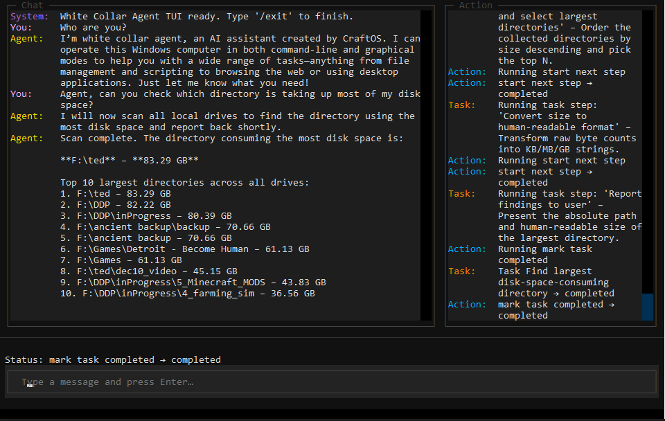

<div align="center">
    
</div>
<br>

<h1 align="center">White Collar Agent</h1>

<div align="center">
  
  
  
  <a href="https://github.com/zfoong/WhiteCollarAgent">
    
  </a>

  

  <a href="https://discord.gg/ZN9YHc37HG">
    
  </a>
  
</div>


---
<p align="center">
  <a href="README.ja.md"> 日本語版はこちら</a> | <a href="README.cn.md"> 中文版README </a>
</p>

## 🚀 Overview

**White Collar Agent** is a minimal yet powerful computer-use AI agent that can perform a series of complex computer-based and browser-based tasks.  
It can autonomously interpret tasks, plan actions, and execute actions to achieve complex goals.
It can switch between CLI and GUI mode, depending on the nature of tasks. 
The code also serves as a foundation for building your own intelligent agents.

Users can:
- 🧠 Use the **built-in agent** to automatically plan and execute complex series of tasks  
- 🧩 **Subclass the base agent** to build their own specialized agent behaviors or workflows
- 💻 Interact with the agent with a **TUI interface**.

<div align="center">
    
</div>

This makes it an ideal tool for organisations, researchers, and developers exploring **System-based agentic AI**, **runtime code generation**, and **autonomous execution** to automate their workflows and achieve results.
This is an open-source project and is still in development, so we welcome any suggestions, contributions, and feedback! You are free to use, host, and monetize this project (with credit given in case of distribution and monetization).

---

## ✨ Features

- 🧠 **Single Base Agent Architecture** — Simple, extendable core that handles reasoning, planning, and execution.  
- ⚙️ **CLI/GUI mode** — Agent can switch between CLI and GUI mode according to the complexity of the task. GUI mode is still in experimental phase 🧪.
- 🧩 **Subclass & Extend** — Build your own agents by inheriting from the base class.  
- 🔍 **Task Document Interface** — Define structured tasks for the agent to perform in-context learning.  
- 🧰 **Actions Library** — Reusable tools (web search, code execution, I/O, etc.).  
- 🪶 **Lightweight & Cross-Platform** — Works seamlessly across Linux and Windows.

> [!IMPORTANT]
> **Note for GUI mode:** The GUI mode is still in experimental phase. This means you will encounter a lot of issues when the agent decides to switch to GUI mode. We are still working on it.

## 🔜 Roadmap

- [ ] **Memory Module** — Coming next!
- [ ] **External Tool integration** — Pending
- [ ] **MCP Layer** — Pending
- [ ] **Proactive Behaviour** — Pending

---

## 🧰 Getting Started

### Prerequisites
- Python **3.9+**
- `git`, `conda`, and `pip`
- An API key for your chosen LLM provider (e.g., OpenAI or Gemini)

### Installation
```bash
git clone https://github.com/zfoong/White-Collar-Agent.git
cd White-Collar-Agent
conda env create -f environment.yml
```

---

## ⚡ Quick Start

Export your API key:
```bash
export OPENAI_API_KEY=<YOUR_KEY_HERE>
or
export GOOGLE_API_KEY=<YOUR_KEY_HERE>
```

Run the CLI tool:
```bash
python -m core.main
```

This executes the built-in **White Collar Agent**, that you can communicate to:
1. Talk to the agent  
2. Ask it to perform complex series of tasks  
3. Run command /help to seek help
4. Get along with the AI agent

---

## Run with container

The repository root included a Docker configuration with Python 3.10, key system packages (including Tesseract for OCR), and all Python dependencies defined in `environment.yml`/`requirements.txt` so the agent can run consistently in isolated environments. 

Below are the setup instruction of running our agent with container.

### Build the image

From the repository root:

```bash
docker build -t white-collar-agent .
```

### Run the container

The image is configured to launch the agent with `python -m core.main` by default. To run it interactively:

```bash
docker run --rm -it white-collar-agent
```

If you need to supply environment variables, pass an env file (for example, based on `.env.example`):

```bash
docker run --rm -it --env-file .env white-collar-agent
```

Mount any directories that should persist outside the container (such as data or cache folders) using `-v`, and adjust ports or additional flags as needed for your deployment. The container ships with system dependencies for OCR (`tesseract`), screen automation (`pyautogui`, `mss`, X11 utilities, and a virtual framebuffer), and common HTTP clients so the agent can work with files, network APIs, and GUI automation inside the container.

### Enabling GUI/screen automation

GUI actions (mouse/keyboard events, screenshots) require an X11 server. You can either attach to your host display or run headless with `xvfb`:

* Use the host display (requires Linux with X11):

  ```bash
  docker run --rm -it 
    -e DISPLAY=$DISPLAY \
    -v /tmp/.X11-unix:/tmp/.X11-unix \
    -v $(pwd)/data:/app/core/data \
    white-collar-agent
  ```

  Add extra `-v` mounts for any folders the agent should read/write.

* Run headlessly with a virtual display:

  ```bash
	docker run --rm -it --env-file .env white-collar-agent bash -lc "Xvfb :99 -screen 0 1920x1080x24 & export DISPLAY=:99 && exec python -m core.main"
  ```

By default the image uses Python 3.10 and bundles the Python dependencies from `environment.yml`/`requirements.txt`, so `python -m core.main` works out of the box.

---

## 🧠 Example: Build a Custom Agent

You can easily create your own specialized agent by extending the base agent:

```python
import asyncio
from core.agent_base import AgentBase

class MyCustomAgent(AgentBase):
    def __init__(
        self,
        *,
        data_dir: str = "core/data",
        chroma_path: str = "./chroma_db",
    ):
        super().__init__(
            data_dir=data_dir,
            chroma_path=chroma_path,
        )
        # Your implementation
        def _generate_role_info_prompt(self) -> str:
            """
            Defines this agent's role, behaviour, and purpose.
            """
            return (
                "You are MyCustomAgent — an intelligent research assistant. "
                "Your role is to find, summarize, and synthesize information from multiple sources. "
                "You respond concisely, prioritize factual accuracy, and cite sources when relevant. "
                "If you cannot find something, you explain why and suggest alternatives."
            )

agent = MyCustomAgent(
    data_dir=os.getenv("DATA_DIR", "core/data"),
    chroma_path=os.getenv("CHROMA_PATH", "./chroma_db"),
)
asyncio.run(agent.run())
```

Here, you’re reusing all the core planning, reasoning, and execution logic —  
just plugging in your own **personality, actions, and task documents**.

---

## 🧩 Architecture Overview

| Component | Description |
|------------|-------------|
| **BaseAgent** | The core reasoning and execution engine — can be subclassed or used directly. |
| **Action / Tool** | Reusable atomic functions (e.g., web search, API calls, file ops). |
| **Task Document** | Describes what the agent must achieve and how. |
| **Planner / Executor** | Handles goal decomposition, script generation, and execution. |
| **LLM Wrapper** | Unified layer for model interactions (OpenAI, Gemini, etc.). |

---

## 🤝 How to Contribute

Contributions and suggestions are welcome! You can contact [@zfoong](https://github.com/zfoong) @ thamyikfoong(at)craftos.net. We currently don't have checks set up, so we can't allow direct contributions but we appreciate any suggestions and feedback.

## 🧾 License

This project is licensed under the [MIT License](LICENSE). You are free to use, host, and monetize this project (you must credit this project in case of distribution and monetization).

---

## ⭐ Acknowledgements

Developed and maintained by [CraftOS](https://craftos.net/) and contributors [@zfoong](https://github.com/zfoong) and [@ahmad-ajmal](https://github.com/ahmad-ajmal).  
If you find **White Collar Agent** useful, please ⭐ the repository and share it with others!
